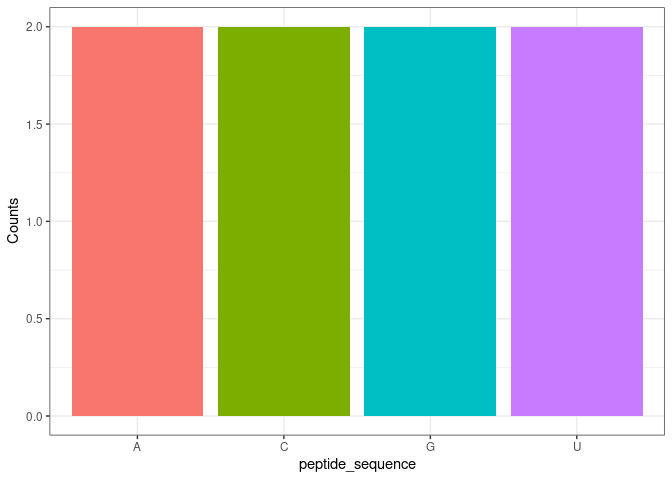
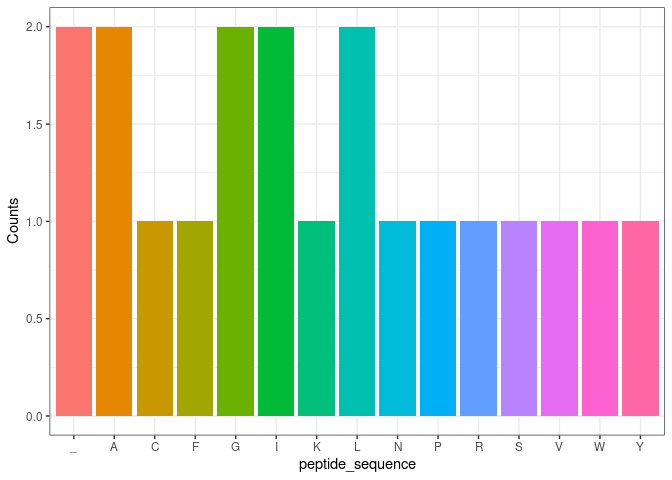

group_18_package
================

``` r
devtools::load_all(".")
#> ℹ Loading cdm
library(cdm)
```

# Brief description of what the package is about :

This package contains a set of 5 functions , it allows the user to
generate a DNA sequence of a given length using create_dna , that will
be transcribed using the transcribe function , later the the get_codons
function will allow the separation of the RNA seq into codons (3 bps ) ,
the vector of codons is used by join to be translate it into the
appropriate amino acid and concatenated to from the primary structure of
the peptide finally the last function (function five ) uses the result
of the fourth above function and create a barplot to show the occurrance
of each amino acid in the newly synthesized protein

# How each function in the package works individually

## Random DNA sequence

``` r
create_dna(size = 10)
#> [1] "GCGGTTACTC"
```

This creates a random DNA sequence, made of the four oligonucleotide,
for the given length.

## Transcribe

this function transcribes the DNA sequence into a mRNA one , converts
the thymine T to Uracil U it takes a string and returs a string

``` r
transcribe("ATGC")
#> [1] "AUGC"
```

## Getcodons

this function should take an RNA sequence (can be also a DNA ) in the
form of a string as a first argument and an integer (start ) as a second
argument that is meant to indicate from which base pair the reading
frame should start . The function will return a vector of 3 letters
string

``` r
get_codons(DNA_seq = "ATGCTG" , start = 1 )
#> [1] "ATG" "CTG"
```

## Join

This function takes a vector of strings ( codons ) , converts each to
it’s corresponding amino acid (as given by codon table ) and concatenate
them , resulting in a peptide (returned as string)

``` r
AAseq("AUG")
#> [1] "M"
```

## Function five

This function takes peptide sequence and returns a bar plot showing the
occurance of each amino acid

aa_count

``` r
aa_count('AUGCGCUA')
```



# How the functions in the package are used in conjuction with each other

Here we first generate a DNA sequence of 60 bps than we transcribe it(we
only convert T -\> U) to convert it to mRNA sequence from the resulting
mRNA seq , the get_codons function create a vector of codons (3bps each)
the translation occurs with the help of AA_seq function Finally the
occurance of the different amino acids contained in the peptide is
displayed in a bar plot

``` r
DNA<-create_dna(size = 60)
mRNA <-transcribe(DNA)
codons<-get_codons(mRNA)
peptide <- AAseq(codons)
aa_count(peptide)
```


